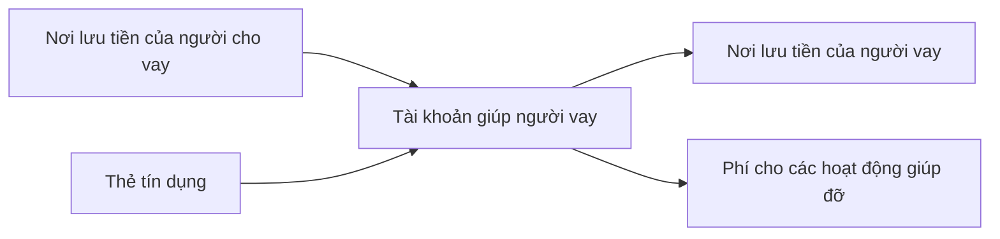
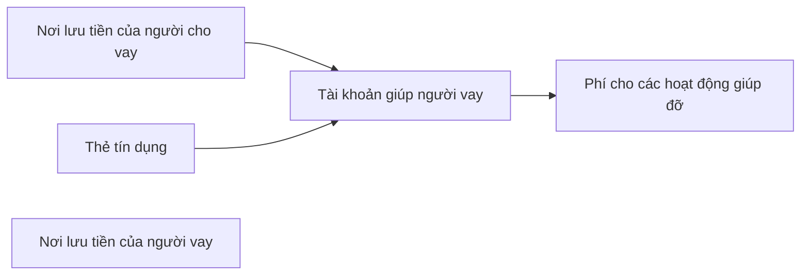
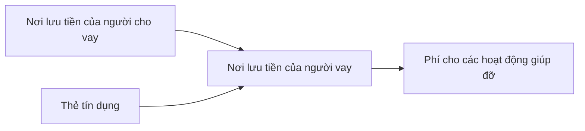

Đây là danh mục tài khoản và ý nghĩa bảng cân đối của [[Ngân hàng mini và mạng lưới cho vay ngang hàng]].

Phí cho các hoạt động giúp đỡ bao gồm:

| -------------------- | Tài khoản bị trừ | Người thu | Chu kỳ     |
| -------------------- | ---------------- | --------- | ---------- |
| Phí mở thẻ giùm      | Người vay        | Dịch vụ   | Một lần    |
| Phí đáo, rút         | Người vay        | Dịch vụ   | Hàng tháng |
| Tiền ăn uống, đi lại | Người vay        | Dịch vụ   | Tùy lúc    |
| Phí thường niên      | Thẻ              | Ngân hàng | Hàng năm   |
| Lãi                  | Thẻ              | Ngân hàng | Tùy lúc    |
| Thanh toán tối thiểu | Người vay        | Ngân hàng | Hàng tháng |

Thẻ là tài sản của quỹ, không phải của cá nhân. Thế nên phí mở thẻ, phí đáo rút, phí thường niên, lãi nên thuộc về thẻ. Phí mở thẻ, phí đáo rút không phải là phí chính thức của ngân hàng, còn phí thường niên, lãi là phí chính thức và bị trừ thẳng , nên không nên để các phí này là tài khoản con của tài khoản thẻ. Nó lại được trả bởi người vay, nên để là một phần của người vay thì cũng tiện.

[[Âm hay dương trong giao dịch là tiền ra hay tiền vào. Âm dương trong cân đối là tiền nợ hay tiền có]]. [[Số âm hay dương có ý nghĩa khác nhau tuỳ vào góc nhìn chuyển tiền hay người thực hiện giao dịch]]

### Mô hình 1: Ghi người cho vay chuyển qua người vay thông qua quỹ giúp người vay

```hledger
2025-06-01 | Bắt đầu Thịnh
    Cá nhân:Hương:TTTT        -4000 kđ
    Cá nhân:Quân:TTTT         -2040 kđ
    Cá nhân:Linh:TTTT          -500 kđ
    Quỹ:Giúp Thịnh                0 kđ
    Cá nhân:Thịnh              6540 kđ
```
Đặc điểm: 
	- Các mối quan hệ được tường minh
	- Có thể làm assertion
	- Khi viết giao dịch thì phải luôn có posting, không 
	- Không tự nhiên trong lúc làm. Phải làm thêm thao tác khi nhập liệu
	- Phí cho các hoạt động giúp đỡ 
	- Nếu người vay dùng nơi lưu tiền để xử lý việc khác thì khó, nên cần tạo thêm một tài khoản chỉ cho việc nợ với người vay
	- Nơi lưu tiền của người vay có thể dùng cho các mục đích khác 

|                                | Loại | Âm                              | 0                          | Dương                         |
| ------------------------------ | ---- | ------------------------------- | -------------------------- | ----------------------------- |
| Tài khoản giúp người vay       | C    | Không xảy ra                    | **Phải luôn bằng 0**       | Còn khoản chưa chuyển         |
| Nơi lưu tiền của người vay     | C    | Không xảy ra                    | Người vay đã trả nợ đầy đủ | ☹️Số tiền họ còn đang nợ mình |
| Nơi lưu tiền của người cho vay | L    | ☹️Số tiền mình còn đang nợ họ   | Mình đã trả nợ đầy đủ      | Mình trả thừa                 |
| Thẻ tín dụng                   | L    | ☹️Số tiền mình còn nợ ngân hàng | Không có nợ                | Ít khi xảy ra                 |

### Mô hình 2: Ghi người cho vay chuyển vào quỹ giúp người vay. Không ghi quỹ giúp người vay chuyển vào người vay

Đặc điểm:
- Phần còn lại của tài khoản giúp người vay chính là số tiền đã chuyển cho người vay
- Ưu điểm:
	- Làm giảm một đoạn nhập liệu, tự nhiên trong lúc làm
	- Phí cho các hoạt động giúp đỡ 
- Nhược điểm:
	- Không thể làm assertion

|                                | Loại | Âm           | 0                          | Dương                   |
| ------------------------------ | ---- | ------------ | -------------------------- | ----------------------- |
| Tài khoản giúp người vay       | C    | Không xảy ra | Người vay đã trả nợ đầy đủ | Số tiền họ đang nợ mình |
| Nơi lưu tiền của người cho vay | C    |              |                            |                         |
| Nơi lưu tiền của người vay     | L    | Không xảy ra | Họ đã trả nợ đầy đủ        | Tài sản của họ          |

### Mô hình 3: Ghi người cho vay chuyển trực tiếp cho người vay

- Ưu điểm:
	- Làm giảm một đoạn nhập liệu
	- Có thể làm assertion
- Nhược điểm:
	- Phí cho các hoạt động giúp đỡ tính vào chi phí chung 
	- Đánh dấu qua tag
	- Nơi lưu tiền của người vay chỉ có thể dùng cho các mục đích vay

|                            | Âm            | 0                          | Dương                 |
| -------------------------- | ------------- | -------------------------- | --------------------- |
| Tài khoản giúp người vay   | Không xảy ra | Người vay đã trả nợ đầy đủ | ☹️Họ còn đang nợ mình |
| Nơi lưu tiền của người vay | Không xảy ra | Họ đã trả nợ đầy đủ        | Tài sản của họ        |


### Mô hình 4: Ghi người cho vay chuyển trực tiếp cho người vay, sau đó chuyển lại cho quỹ giúp người vay
```hledger
2025-10-05 | Cường trả nợ  ; Giúp:Cường
    Quỹ:Quả Cầu:VĐT:Momo          250 kđ
    Quỹ:Quả Cầu:VĐT:Momo         -250 kđ
    Quỹ:Quả Cầu:Giúp:Cường                         250 kđ
    Cá nhân:Cường:VĐT:Momo                 -250 kđ
```
## Xem thêm
[[Kinh nghiệm dùng hledger]]
[[Danh mục tài khoản của Nhật]]


let's say there is this flow: ... --> A, B, C --> D --> E, F, G. How can I get the report 
