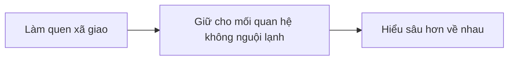

[[Muốn bán hàng tốt cần có mối quan hệ]]. Đây là các giai đoạn của việc thiết lập mối quan hệ:

Do [[Các công ty ép chỉ tiêu khiến cho việc đi chào hàng không giúp phát triển một mối quan hệ chất lượng]], nên những người bán hàng cần phải có một cách thức để tăng số lượng mối quan hệ mà không tốn quá nhiều thời gian. Mặt khác, các công ty cũng không hỗ trợ nhân viên xây dựng thương hiệu, dù nó có lợi cho chính công ty 
Sự hỗ trợ của các công ty chính là việc [[Các buổi sự kiện mời khách công ty (OPP) không chỉ để dễ chốt hợp đồng, mà còn để đánh giá đại lý và tập cho họ khả năng tự tổ chức các buổi của riêng mình|tổ chức các buổi OPP]], nhưng không phải lúc nào cũng đủ. Còn việc xây dựng hệ thống như thế này thì họ xem đây là lợi thế cạnh tranh của mỗi người, nên mỗi người cần tự lo cho mình

Đã có một bài viết riêng cho giai đoạn [[Mở rộng mối quan hệ|làm quen xã giao]]. Ở bài này sẽ giả định rằng bạn đã có một lượng người theo dõi mạng xã hội của bạn rồi, và công việc của chúng ta là giữ các liên kết đó không bị nguội lạnh, để khi họ có nhu cầu tới sản phẩm thì sẽ nhớ tới mình đầu tiên.

Một trong những cách đó là tự động hoá việc hiện diện trên tường của những người theo dõi càng nhiều càng tốt.
Mục tiêu của những bài đăng này là

**Họ muốn xem hành trình của bạn ở công việc này**. Hành trình của một người xa lạ thì không đáng quan tâm, nhưng với một người họ đã bắt đầu có sự quan tâm thì sẽ không quá phiền để đọc. Họ sẽ thấy đây là một người có thực trong cuộc sống của họ. Và khi họ có nhu cầu sản phẩm thì họ sẽ nghĩ tới mình đầu tiên. Thương hiệu cá nhân lúc này không quá nhấn mạnh vào việc "Tôi là một chuyên gia trong lĩnh vực này", mà chủ yếu là "Tôi là một người có thực trong cuộc sống của bạn". Độ tin tưởng vào cái sau có khi cũng cao không kém vào cái trước.

**Việc họ thấy được mình nhiều lần quan trọng hơn việc mình là ai.** Tức là tần suất xuất hiện quan trọng hơn nội dung. Để được các mạng xã hội đẩy bài lên tường thì ngoài chuyện viết đều thì nắm bắt được xu hướng cũng là một lợi thế.
 để người ta biết rằng mình vẫn còn đang làm công việc này
Người ta muốn xem hành trình ở công việc này, để biết rằng mình vẫn còn đang làm công việc này
Hành trình cá nhân

> [!Summary] SWOT
> - **Điểm mạnh** là có kiến thức về sản phẩm, nhưng lại gặp **thách thức** là [[Muốn bán hàng tốt cần có mối quan hệ|thiếu mối quan hệ]]
> - **Cơ hội** là người ta muốn xem hành trình của mình ở công việc này, và tần suất xuất hiện quan trọng hơn nội dung, nhưng lại gặp **điểm yếu** là cần phải tự làm tất cả một mình, không có đội ngũ 

## Ngoài việc làm cái này ra thì còn những cách thức nào khác
| Tại sao không...                                               | Câu trả lời                        |
| -------------------------------------------------------------- | ---------------------------------- |
| ...đặt quảng cáo?                                              | Không có tiền                      |
| ...tập trung vào việc tìm người cần mình?                      | Không đủ thời gian để đạt chỉ tiêu |
| ...tham gia sinh hoạt trong các CLB?                           | Không đủ thời gian để đạt chỉ tiêu |
| ...tự tổ chức các buổi OPP?                                    | Không đủ thời gian để đạt chỉ tiêu |
| ...tham gia làm cùng với người đã có sẵn thương hiệu trên MXH? | Lương họ trả chưa chắc đủ sống, không dễ tìm được người cùng định hướng mới mình   |
| ...tham gia nhóm của người làm tư vấn độc lập?                 | Lương họ trả chưa chắc đủ sống     |
| ...đăng lại bài viết hay của người khác?                       |                                    |

[[Vấn đề đạo đức khi tự động hoá việc đăng bài trên MXH]]
