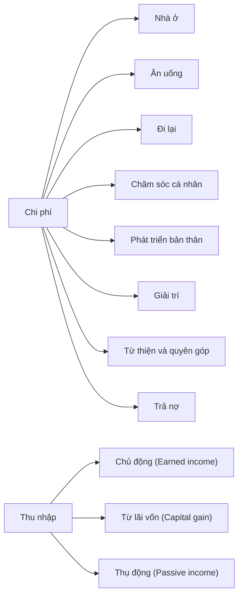

[[❓Quỹ chung không được xem là tài sản của mình, nhưng có tác dụng tương đương]]
[[Danh mục tài khoản và ý nghĩa bảng cân đối của quỹ]]
[[Danh mục tài khoản của Nhật]]

---
### Nợ
### Chủ động (Earned income)
### Từ lãi vốn (Capital gain)
### Thụ động (Passive income)
### Tiết kiệm và đầu tư

## Chi phí
### Nhà ở
- Thuê nhà
- Điện 
- Nước
- Ga
- TV
- Internet
- Rác thải
- Nội thất/đồ gia dụng trong nhà
	- Bảo trì/sửa chữa/cải tiến
- Bãi cỏ/vườn/cây cảnh
- Điện thoại
- Bảo hiểm tài sản
- Dọn dẹp/chất tẩy rửa

### Ăn uống
- Gạo
- Dầu
- Gia vị
- Thực phẩm mua về nhà
- Ăn ngoài
- Cafe
- Trà/ nước ép

### Đi lại
- Thanh toán phương tiện đi lại
- Phương tiện công cộng
- Nhiên liệu/ Xăng
- Đăng ký/ cấp phép
- Sửa chữa/ Bảo dưỡng
- Đậu xe
- Bảo hiểm xe
- Phí cầu/ đường

### Chăm sóc cá nhân
- Bác sỹ/ Nha sỹ
- Thuốc men
- Cấp cứu/ Khẩn cấp
- Thực phẩm chức năng
- Làm đẹp/ Mỹ phẩm
- Trang phục
- Giặt giũ
- Thể thao

### Phát triển bản thân
- Khoá học ngắn hạn
- Khoá học dài hạn
- Sách
- Hội thảo
- Công cụ/ Văn phòng phẩm
- Podcast/ Audio

### Giải trí
- Xem phim tại rạp
- Video/ DVD
- Netflix/ Spotify/ Subscription
- Biểu diễn nghệ thuật/ Sự kiện thể thao
- Sự kiện thể thao
- Trò chơi điện tử
- Du lịch
- Album ca nhạc

### Từ thiện và quyên góp
- Trao tặng
- Quyên góp 

### Nợ
- Vay/ Mượn từ người thân
- Vay mua nhà
- Ô tô/ xe máy
- Thẻ tín dụng

## Thu nhập
### Chủ động (Earned income)
- Tiền lương
- Tiền làm thêm/ tăng ca
- Thưởng
- Kinh doanh

### Từ lãi vốn (Capital gain)
- Bán cổ phiếu, trái phiếu
- Bán nhà

### Thụ động (Passive income)
- Hỗ trợ từ gia đình / Bạn bè
- Lương hưu
- Bảo hiểm
- Trợ cấp
- Quà tặng được nhận
- Tiền được hoàn lại
- Cổ tức
- Cho thuê dịch vụ

### Tiết kiệm và đầu tư
- Quỹ khẩn cấp (mergency Fund)
- Quỹ chìm (inking Fund)
- Quỹ đầu tư
- Tiền gửi tiết kiệm
