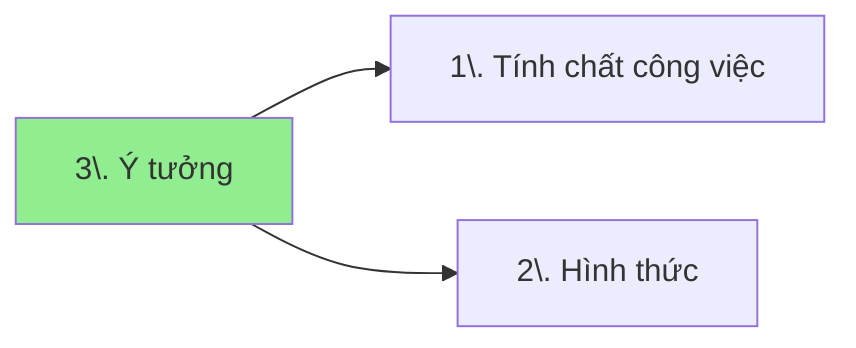

[[3 Ý tưởng|So sánh các yêu cầu đầu vào của các ý tưởng kiếm tiền]]
## Mối quan hệ giữa các khái niệm


## Danh mục
```dataview
list rows.file.link
from "📜Tài nguyên/Ý tưởng kiếm tiền"   
group by split(file.folder, "/" )[3] 
```
