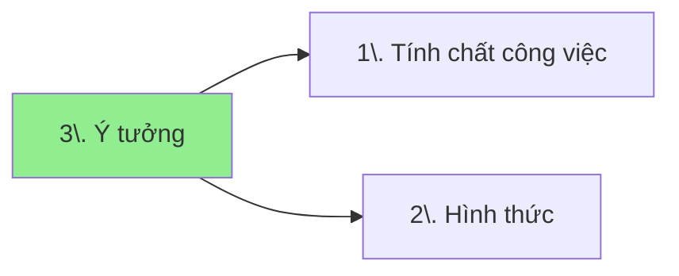

[[📜Tài nguyên/Ý tưởng kiếm tiền/Ý tưởng/Ý tưởng|So sánh các yêu cầu đầu vào của các ý tưởng kiếm tiền]]
## Mối quan hệ giữa các khái niệm


## Danh mục
```dataview
list rows.file.link
from "📜Tài nguyên/Ý tưởng kiếm tiền"   
group by split(file.folder, "/" )[3] 
```

## Mục tiêu
- Cung cấp thông tin chi tiết để hiểu rõ ngọn ngành về công việc
- Giới thiệu công việc đang có

Nhiều khi cần tách ra chứ không để chung được