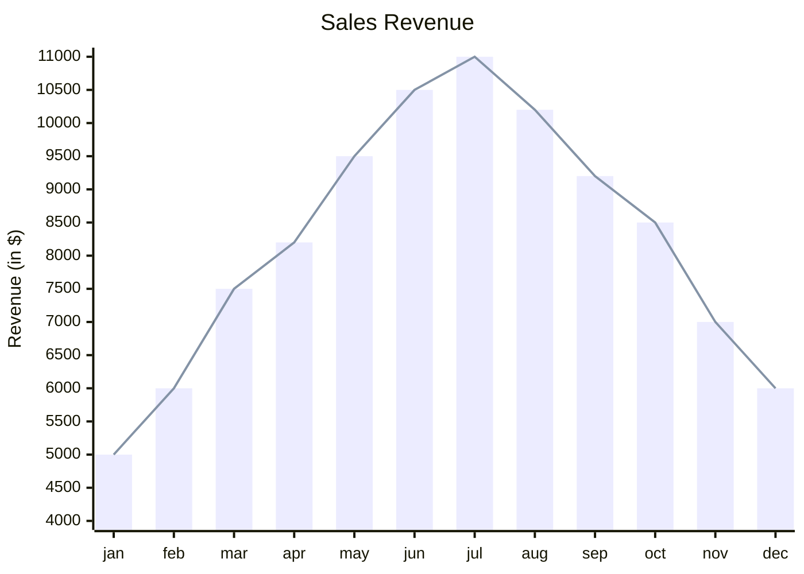

Tính chất công việc:: [[Cần biết lập trình]], [[Làm qua mạng]]
Hình thức:: [[Tự kinh doanh, đầu tư]]

[[13-08-2024]] 28630 lượt tải, 3177 ngày, 9 lần tải/ngày

Bài chi tiết:: [Bộ thẻ học từ vựng tiếng Anh nâng cao (GRE) – Quả Cầu](https://quảcầu.cc/bo-the-hoc-tu-vung-tieng-anh-nang-cao?utm_source=Vault+B+Tồn+tại+trong+thế+giới+tư+bản+(Tài+nguyên)&utm_medium=Vault&utm_campaign=Tài+nguyên+khác%2Cngôn+ngữ%2Cnét+nghĩa+ẩn%2CHọc+tiếng+Anh%2Ckhoa+học+nhận+thức&utm_content=&utm_term= )
